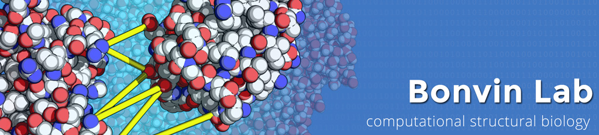

# Welcome to the BonvinLab GitHub page

The BonvinLab is a Computational Structural Biology group that focuses on dissecting, understanding and predicting biomolecular interactions at the molecular level. Our research is focused on the development of integrative computational methods for the study of biomolecular interactions, with a particular emphasis on the structural characterization of protein-protein and protein-ligand complexes.

We are part of the [Bijvoet Center for Biomolecular Research](https://www.uu.nl/en/research/bijvoet-centre-for-biomolecular-research) at [Utrecht University](https://www.uu.nl/),  affiliated with the [Netherlands eScience Center](https://www.esciencecenter.nl/) and one of the core applications of [BioExcel Center of Excellence for Computational Biomolecular Research](https://bioexcel.eu/).

## Featured research software

- [haddock v3](https://github.com/haddocking/haddock3): The  **H**igh **A**mbiguity **D**riven biomolecular **DOCK**ing is our flagship software, it is an integrative platform for modelling biomolecular complexes. It is one of the most popular software for protein-protein and protein-ligand docking.
- [pdb-tools](https://github.com/haddocking/pdb-tools): A dependency-free cross-platform swiss army knife for PDB files.
- [prodigy](https://github.com/haddocking/prodigy): Predict the binding affinity of protein-protein complexes from structural data
- [arctic3d](https://github.com/haddocking/arctic3d): Automatic Retrieval and ClusTering of Interfaces in Complexes from 3D structural information
- [proabc-2](https://github.com/haddocking/proABC-2): Deep learning framework to predict antibody paratope residues

## Useful utilities

- [haddock-restraints](https://github.com/haddocking/haddock-restraints): Generate restraints to be used in HADDOCK
- [haddock-runner](https://github.com/haddocking/haddock-runner): Run large scale HADDOCK simulations using multiple input molecules in different scenarios
- [haddock-tools](https://github.com/haddocking/haddock-tools): Set of useful utility scripts developed by the BonvinLab group members
- [haddock2mmcif](https://github.com/haddocking/haddock2mmcif): Encode information from a HADDOCK run to a cif file to be deposited in PDB-Dev

## Contact

If you would like to get in touch with us, please send an email to <bonvinlab.support@uu.nl>
